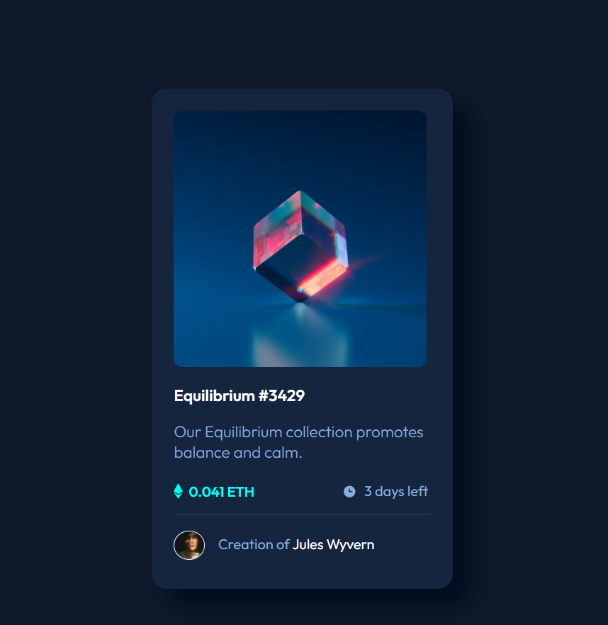
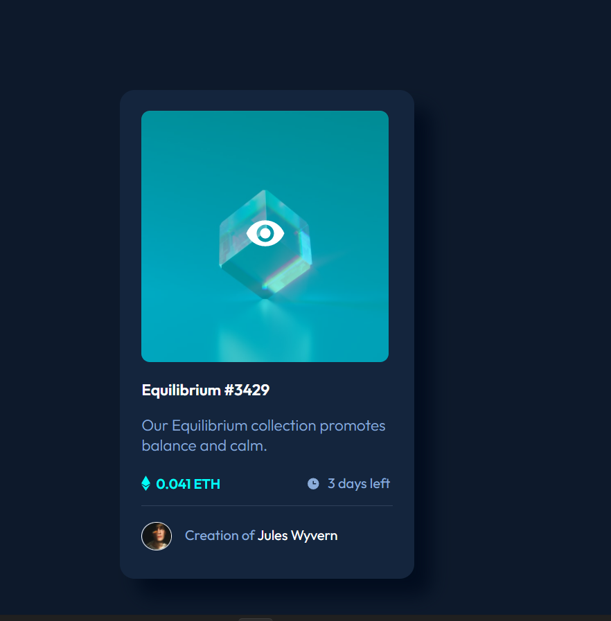

## Overview

### The challenge

Users should be able to:

- View the optimal layout depending on their device's screen size
- See hover states for interactive elements

### Screenshot

### Links

- Solution URL: [Link](https://www.frontendmentor.io/solutions/nftpreviewcardcomponent-JD-L0QVxZ)
- Live Site URL: [Link](https://sandhya312.github.io/NFT-preview-card-component/)

## My process

### Built with

- Semantic HTML5 markup
- CSS custom properties
- Flexbox
### Useful resources

## Author

- Linkedin - [@sandhyakumarii](https://www.linkedin.com/in/sandhyakumarii/)
- Frontend Mentor - [@Sandhya312](https://www.frontendmentor.io/profile/Sandhya312)
- Twitter - [@Sandhya06286768](https://www.twitter.com/Sandhya06286768)